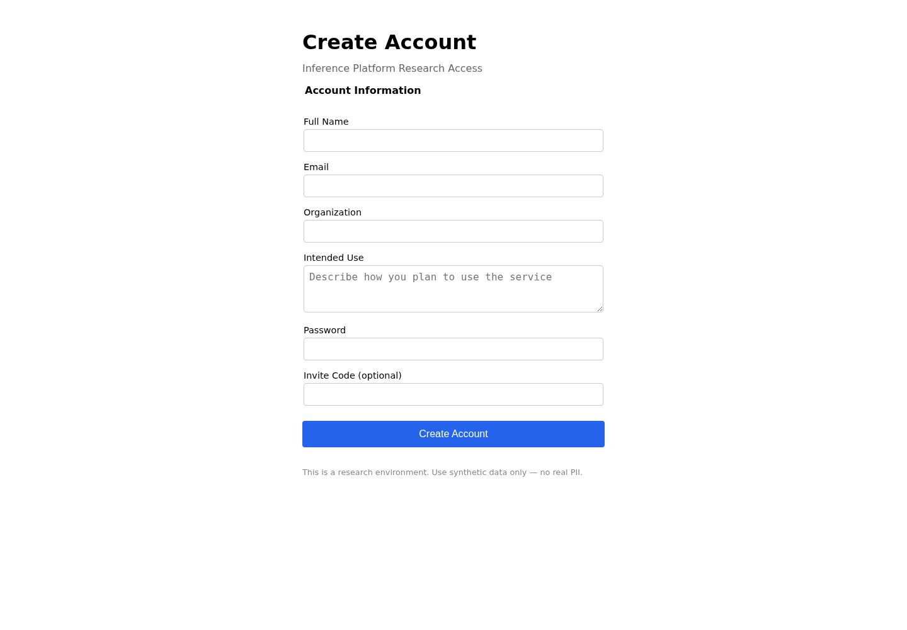
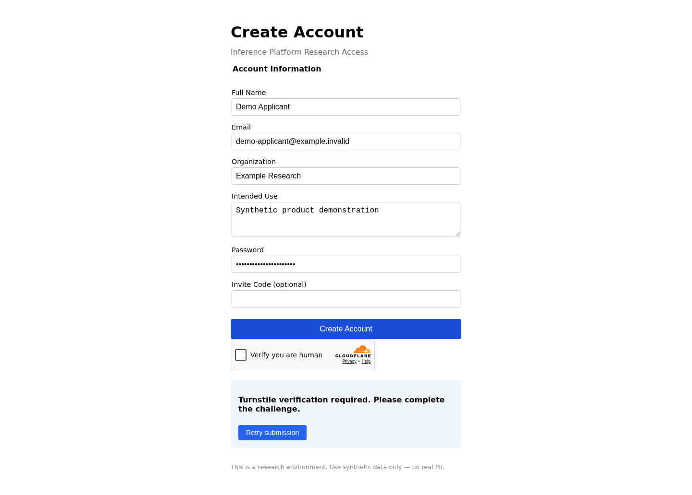

  

  <strong>Deterministic, server-led admission defense for signup and application workflows.</strong>

  <a href="https://fireraid-production.benevolentjoker.workers.dev/signup">Live Showcase</a> ·
  <a href="docs/ARCHITECTURE.md">Architecture</a> ·
  <a href="docs/INTEGRATION.md">Integration</a> ·
  <a href="docs/DEPLOYMENT.md">Deployment</a>

  
  

<strong>No LLM in the defense path · No invasive fingerprinting · Host-owned admission policy</strong>

FireRaid adds deterministic, session-bound defenses to automated access
attempts by issuing per-session challenges, correlating server-verifiable
evidence, and integrating the resulting assessment into the host's existing
admission workflow.

The [live showcase](https://fireraid-production.benevolentjoker.workers.dev/signup)
is an owner-hosted product demonstration. Use synthetic data only; it is not a
public service or a production guarantee.

## What FireRaid is—and is not

| FireRaid is | FireRaid is not |
|---|---|
| Deterministic admission middleware | An LLM classifier |
| Server-led and host-neutral | A browser fingerprinting service |
| Produces auditable admission evidence | A universal bot-detection system |
| Integrates with existing signup/application flows | An account-approval authority |

## See it working

These captures come from the live FireRaid showcase, not mockups. The first
shows the applicant-facing signup flow. The second shows the reference
deployment refusing a submission that has not satisfied its configured
verification requirement.

<table>
  <tr>
    <td><strong>Applicant-facing form</strong></td>
    <td><strong>Fail-closed response</strong></td>
  </tr>
  <tr>
    <td></td>
    <td></td>
  </tr>
</table>

## Why FireRaid exists

Agents are becoming a real access-control problem. In the wrong hands, they
can automate exploitative access: abuse, fraud, resource exhaustion,
credential creation, and behavior that defeats the intent of a service.
People need practical, inspectable ways to thwart autonomous access when that
access would be harmful.

FireRaid is a narrower, more accountable answer. Its defense path is
deterministic and server-led, combining session-bound challenges, interaction
signals, verification, telemetry, correlation, and explicit policy signals
into evidence that a host can inspect and act on.

## What it provides

- **Per-session defense profiles** with randomized routes, interaction
  expectations, challenges, and canaries.
- **Layered admission signals** covering request integrity, CSRF and session
  checks, route sequencing, interaction depth, verification, timing, and
  server-side correlation.
- **Adversarial evaluation** across browser, raw-HTML, simplified-DOM, and
  model-backed agents.
- **Host-owned decisions.** FireRaid returns a neutral applicant receipt and a
  host-facing assessment; the host decides whether to approve, hold, reject,
  rate-limit, or investigate.
- **Auditable evidence** through receipts, event chains, profile versions, and
  enforcement outcomes.

## How it works

~~~text
Applicant
   │
   ▼
Host signup/application route
   │
   ├── FireRaid session + deterministic defense profile
   │       ├── semantic canaries
   │       ├── interaction signals
   │       ├── verification
   │       └── session-bound challenges
   │
   ▼
Server-side correlation
   │
   ▼
ACCEPT / REVIEW / QUARANTINE
   │
   ├── neutral applicant receipt
   └── auditable host assessment
~~~

The browser is not authoritative. Client-side signals matter only when they
correlate with server-observed state. FireRaid does not collect model prompts
or transcripts, require invasive fingerprinting, or put an LLM in the defense
path.

## Evidence

**Bounded experimental evidence.** In the E6 evaluation, autonomous-agent
cells produced **2/10 defended account creations versus 10/10 in control**.
Under the experiment's stated matched-cell analysis and scope rules, the
analyzer reports **53.3% attack-rate reduction** when the human cells are
included. Human controls completed **5/5 in both arms**.

This evaluation used one model, one agent architecture, and a small sample. It
demonstrates that FireRaid's mechanism can materially affect autonomous signup
behavior under the tested conditions. It does **not** establish a universal
bot-detection rate or predict effectiveness against arbitrary agents,
architectures, or deployments. See [Release Status](docs/RELEASE-STATUS.md)
for the complete claim surface and evidence pointers.

## Quick start

FireRaid is source-distributed at present:

~~~bash
git clone https://github.com/B-A-M-N/FireRaid.git
cd FireRaid
npm ci
npm run dev:origin
~~~

Open [http://127.0.0.1:3456/signup](http://127.0.0.1:3456/signup) and use
synthetic data. The local origin runtime does not require a Cloudflare
account. The reference origin is for local development and evaluation only;
it is not a production deployment.

## Production use

Customer-facing production use requires operator-owned durable stores, a real
host-owned or provider-backed verification adapter, production secrets, an
authoritative edge rate limiter for the admin login surface, and
deployment-specific migration and smoke verification.

The Cloudflare Worker and D1 setup in this repository is a reference
deployment for the showcase, not a requirement of the host-neutral product.
The owner-hosted showcase intentionally permits the tracked limiter placeholder;
each operator must replace it before running a customer-facing deployment.
Read the [Deployment Guide](docs/DEPLOYMENT.md) for demo and production
responsibilities, and the [Integration Guide](docs/INTEGRATION.md) for
adapter contracts and the submission state machine.

## Product and evaluation planes

| Product | Evaluation |
|---|---|
| Defends a real host flow | Attacks and measures the defense |
| createFireRaidMiddleware + admit | createEvaluationMiddleware + admitEvaluation |
| No model calls in the defense path | Optional adversarial model calls |
| Host-owned durable adapters | Explicitly labeled test/reference stores |

Evaluation code is not imported by the product path. An experiment result is
not a promise that a deployed service will stop every agent.

## Documentation

| Need | Read |
|---|---|
| Understand the system | [Architecture](docs/ARCHITECTURE.md) |
| Integrate a host application | [Integration guide](docs/INTEGRATION.md) |
| Deploy the reference Worker | [Deployment guide](docs/DEPLOYMENT.md) |
| Review threats and limits | [Threat model](docs/THREAT-MODEL.md) |
| Review security and report vulnerabilities | [Security](docs/SECURITY.md) |
| Understand product invariants | [Product invariants](docs/INVARIANTS.md) |
| Reproduce experiments | [Experiments](docs/EXPERIMENTS.md) |
| Check evidence and claim tiers | [Release status](docs/RELEASE-STATUS.md) |
| Review accessibility requirements | [Accessibility](docs/ACCESSIBILITY.md) |
| Review the admin surface | [Admin dashboard](docs/ADMIN.md) |

## Development and verification

~~~bash
npm run typecheck
npm run lint
npm run test:unit
npm run test:product
npm run release:verify:fast
~~~

The full test and release gates are documented in the
[Deployment Guide](docs/DEPLOYMENT.md). Production E2E checks require an
explicitly configured target.

## Security and responsible use

FireRaid is defense-in-depth, not a universal bot detector. Operators remain
responsible for approval policy, identity, rate limiting, data retention,
incident response, and the consequences of false positives. Read the
[Security](docs/SECURITY.md) and [Threat Model](docs/THREAT-MODEL.md) before
deploying. Follow the [vulnerability reporting instructions](docs/SECURITY.md#vulnerability-reporting)
for security concerns.

## License

Source is available under the [FireRaid Community Source License 1.0](LICENSE).
Free production use is permitted for qualifying inference providers,
educational and research institutions, public-sector organizations, and other
permitted service operators; other uses may require separate authorization.
Deceptive or unauthorized inference resale is excluded. Read the complete
terms in [LICENSE](LICENSE).

## Acknowledgements

FireRaid was independently developed in part from thinking about abuse
resistance for public inference services, including FreeInference.org. It is
an independent, general-purpose project and is not affiliated with, sponsored
by, commissioned by, endorsed by, or developed under the direction of
FreeInference.org. FreeInference.org did not request or approve FireRaid and
is not responsible for its design, implementation, documentation, or claims.

## Supporting Public Inference

Public inference gives more people room to learn, experiment, build, and
participate. If FireRaid is useful to you, please consider supporting or
sponsoring [FreeInference.org](https://freeinference.org) through its official
support options; FireRaid does not collect or redirect contributions on its
behalf.
